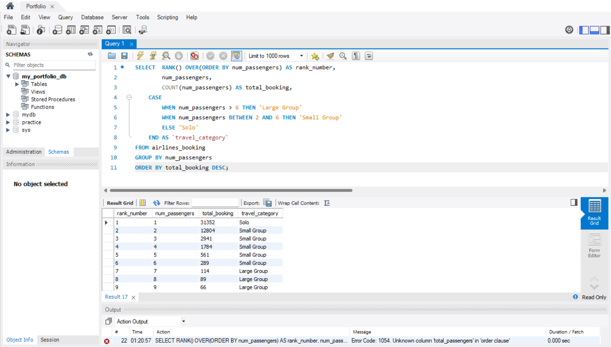
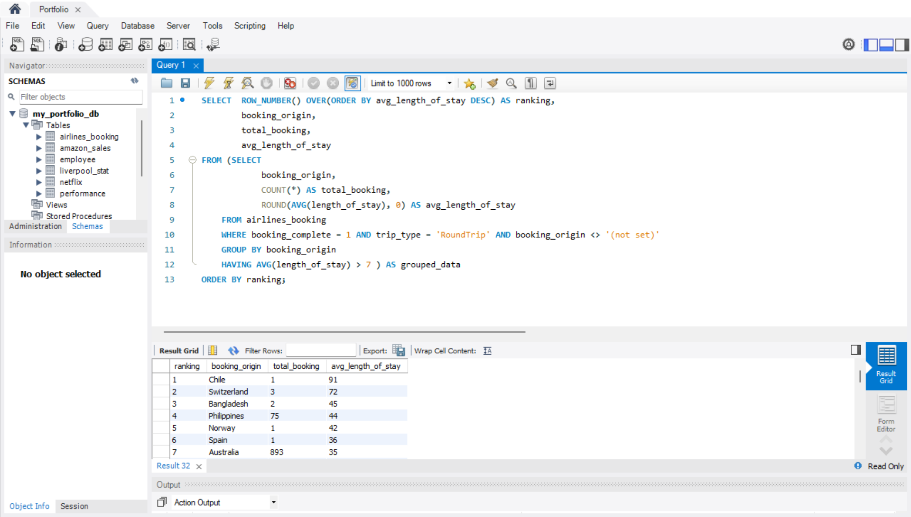

# AIRLINES BOOKING DATASET
I will test my advanced SQL knowledge in this portfolio by analyzing airline booking data. The goal is to demonstrate data cleaning, aggregation, conditional logic using CASE statements, and subqueries to derive actionable insights from the dataset. I asked ChatGPT to act as my manager and give me instruction on what to write on MySQL.

## THE DATASET
The dataset contains 50,000 data of customers booking.

Link: [Airlines Booking Dataset](customer_booking.csv)

Below is how the dataset looks like on MySQL


# PROJECT OBJECTIVE
The goal of this project is to analyze airline booking patterns to uncover customer behavior and identify business opportunities. Using SQL, I explored passenger segmentation, service preferences, and booking trends to generate actionable insights for decision-making.

# ADVANCED QUERIES
The advanced queries in this portfolio are CASE, subqueries, ranking and windonw function, aggregation and grouping.

## CASE

### 1. Segment our passengers into travel groups (Solo, Small, Large) and tell me how many bookings fall into each segment.

#### The Query
```
SELECT
  CASE
    WHEN num_passengers > 6 THEN 'Large Group'
        WHEN num_passengers BETWEEN 2 AND 5 THEN 'Small Group'
        ELSE 'Solo'
	END AS travel_group, 
    COUNT(num_passengers) AS total_booking
FROM airlines_booking
GROUP BY
	CASE
		WHEN num_passengers > 6 THEN 'Large Group'
        WHEN num_passengers BETWEEN 2 AND 5 THEN 'Small Group'
        ELSE 'Solo'
	END
ORDER BY total_booking DESC;
```

#### Insight
The Result
This query will show the total number of bookings from customers. The numbers have been categorized in large group, small group, and solo. From this query, we are able to see how many of our customers travel in large, small group or solo.

Real-world Analysis
Out of 50,000 customers:
- Only 269 customers (0.5%) booked in large groups.
- 36% of customers booked in small groups.
- 63% were solo travelers.

The number of large-group bookings is significantly lower compared to the other two categories. This suggests that the airline’s customer mostly consists of solo and small-group travelers. Therefore, marketing and promotional strategies could focus on strengthening these two segments. As for instance, offering single-seat discounts or small-group bundles to increase overall booking volume.

##### Screenshot of the Query


### 2. Identify bookings where passengers requested extras (extra baggage, preferred seat, or in-flight meals) and classify each booking as “High Extras”, “Medium Extras”, or “No Extras” based on how many extras were requested. Show the total bookings in each category.

#### The Query
```
SELECT
  CASE
		WHEN (wants_extra_baggage + wants_preferred_seat + wants_in_flight_meals) > 3 THEN 'high request'
		WHEN (wants_extra_baggage + wants_preferred_seat + wants_in_flight_meals) BETWEEN 1 AND 2 THEN 'normal request'
		ELSE 'no request'
	END AS extra_request,
	COUNT(*) AS total_booking
FROM airlines_booking
GROUP BY
	CASE
		WHEN (wants_extra_baggage + wants_preferred_seat + wants_in_flight_meals) > 3 THEN 'high request'
		WHEN (wants_extra_baggage + wants_preferred_seat + wants_in_flight_meals) BETWEEN 1 AND 2 THEN 'normal request'
		ELSE 'no request'
	END
ORDER BY total_booking DESC;
```

#### Insight
The Result
This query shows the total number of bookings that include any extra request, such as extra baggage, preferred seat, or in-flight meals.

Real-world Analysis
- 38.45% of customers do not purchase any of our extra service. Special promotions on our extra services have the potential to boost our sales (decrease the percentage) on this. As for example, certain period of time, we should offer special discount if our customers take at least two of our special service. Pay full for extra baggage and get 10% off for preferred seat price or in flight meals.
- The rest of our customers have bought at least 1 extra service from us. These campaigns could also positively impact customers who already purchase extras.

#### Screenshot of the Query


## SUBQUERY

### 1. Find all bookings where the length of stay is longer than the average stay, and show how many total bookings fall under this category and also the average of length of stay

#### The Query
```
SELECT 	ID, 
		num_passengers,
        length_of_stay,
        trip_type, 
		(SELECT COUNT(*) FROM airlines_booking WHERE length_of_stay > (SELECT AVG(length_of_stay) FROM airlines_booking)) AS total_booking,
        (SELECT ROUND(AVG(length_of_stay), 0) FROM airlines_booking) AS avg_length_of_stay
FROM airlines_booking
WHERE length_of_stay > (SELECT AVG(length_of_stay) FROM airlines_booking)
ORDER BY length_of_stay DESC;
```

#### Insight
The Result
This query identifies all bookings where the trip’s length of stay is above the average across all customers. It also displays the overall number of bookings exceeding that average and the calculated average length of stay for context. Besides that, the result also shows the average of length of stay.

Real-world Analysis
- The data shows that 15,966 customers (around 32% of total bookings) have a length of stay longer than the average of 5 days. The longest customer stays up to 700 days.

Conclusion
- Customers with longer stays are likely to have extended trips, vacations, or business stays, which often correlate with higher spending on add-ons like baggage or in-flight meals.
- Airlines can target this segment with loyalty rewards, upgrade offers, or extended-stay partnerships (e.g., hotel collaborations, car rental).
- Although these customers might not travel frequently, they bring higher revenue per trip.

#### Screenshot of the Query


### 2. How many Internet bookings have more passengers than the average number of passengers in Mobile bookings?

#### The Query
```
SELECT 
    ID,
    num_passengers,
    sales_channel,
    (SELECT ROUND(AVG(num_passengers), 0)
     FROM airlines_booking
     WHERE sales_channel = 'Mobile') AS avg_mobile_passengers,
     (SELECT SUM(num_passengers) FROM airlines_booking WHERE sales_channel = 'internet') AS internet_booking,
     (SELECT SUM(num_passengers) FROM airlines_booking WHERE sales_channel = 'mobile') AS mobile_booking
FROM airlines_booking
WHERE sales_channel = 'Internet'
  AND num_passengers > (
        SELECT AVG(num_passengers)
        FROM airlines_booking
        WHERE sales_channel = 'Mobile'
  )
ORDER BY num_passengers DESC;
```

#### Insight
The Result
The query identifies Internet bookings that exceed the average group size of Mobile bookings and provides the total passengers for each channel.

Real-world Analysis
- Average passengers per Mobile booking: 2
- Total passengers via Mobile: 8,900
- Total passengers via Internet: 70,662

Conclusion
- Only 2 Internet bookings exceed the average Mobile booking size, indicating that larger groups predominantly book via Mobile.
- Actionable Insight: Airlines could target Mobile users with group booking promotions or discounts to attract more large-group customers and increase overall revenue.

#### Screenshot of the Query


## RANK AND WINDOW FUNCTIONS

### 1. Provide the ranking of number of passengers per booking size, categorized into Solo, Small Group, and Large Group, and show how many bookings fall under each passenger count

#### The Query
```
SELECT 	RANK() OVER(ORDER BY num_passengers DESC) AS rank_number,
		num_passengers,
        COUNT(num_passengers) AS total_passengers,
	CASE
		WHEN num_passengers > 6 THEN 'Large Group'
        WHEN num_passengers BETWEEN 2 AND 6 THEN 'Small Group'
        ELSE 'Solo'
	END AS `travel_category`
FROM airlines_booking
GROUP BY num_passengers
ORDER BY total_passengers DESC;
```

#### Insight
The Result
The query ranks the total number of bookings based on travel group categories; Solo, Small Group, and Large Group. This ranking helps identify which type of booking contributes the most to overall sales volume.

Real-world Analysis
- From the result, 63% of booking from our customers are placed in solo group. That is more than half of our total booking.
- 37% of booking consists 2 to 6 customers which have been categorized in 'small group'.
- The lowest percentage of booking comes from large group travel category which is only 0.5%

Conclusion
- The significant gap between large group and the other two groups indicate the potential of growth in this category.
- In order to reduce the gap, we could consider offer promotion that involved with large group booking, collab with hotel booking for special price for large group.

#### Screenshot of the Query


### 2. Write a query that lists each trip type and sales channel with the total completed bookings and ranks all combinations from highest to lowest.

#### The Query
```
SELECT 
	trip_type,
    sales_channel,
    COUNT(*) AS total_completed_bookings,
    ROW_NUMBER() OVER(PARTITION BY trip_type ORDER BY COUNT(*) DESC) AS channel_rank
FROM airlines_booking
WHERE booking_complete = 1
GROUP BY trip_type, sales_channel
ORDER BY channel_rank;
```

#### Insight
The Result
The query ranks sales channels for each trip type based on the total number of completed bookings, showing which channels are most popular for different trip types.

Real-world Analysis
- There are 5 bookings for circle trips, all completed via the Internet.
- For one-way trips, 18 bookings are via Internet and 5 via Mobile.
- The largest share comes from round-trip Internet bookings, totaling 6,846 bookings, while round-trip Mobile bookings are 607, still higher than other combinations.

Conclusion:
- Customers clearly prefer round-trip travel and mostly complete bookings through the Internet.
- To leverage this demand, we can enhance our online booking system to make it even easier for customers to complete bookings.
- There is also an opportunity to promote mobile app bookings, since current numbers are low, potentially by improving app usability or offering incentives.

#### Screenshot of the Query


## AGGREGATION + HAVING

### 1. Find which sales channels have more than 500 completed bookings. For each qualifying channel, also calculate the average number of passengers per booking.

#### The Query
```
SELECT 	sales_channel,
		COUNT(*) AS total_booking,
        ROUND(AVG(num_passengers), 0) AS avg_passengers
FROM airlines_booking
WHERE booking_complete = 1
GROUP BY sales_channel
HAVING COUNT(*) > 500;
```

#### Insight
The Result
The query shows average number of passengers for each sales channel with more than 500 booking complete.

Real-world Analysis
Out of 7,478 completed bookings, 92% with an average of 2 passengers are from the Internet sales channel, and 8% are from Mobile.

Conclusion
- A significant number of customers prefer using the Internet to book trips. Enhancing the online booking system could further improve completion rates.
- We can also improve the mobile app experience to attract more customers to complete bookings via mobile.

#### Screenshot of the Query


### 2. Find which booking origins have an average length of stay greater than 7 days, but only for completed round-trip bookings. For each qualifying origin, also show the total number of bookings. Make sure to handle any invalid data

### The Query
```
SELECT	ROW_NUMBER() OVER(ORDER BY avg_length_of_stay DESC) AS ranking,
		booking_origin,
        total_booking,
        avg_length_of_stay
FROM (SELECT 	
			booking_origin,
			COUNT(*) AS total_booking,
			ROUND(AVG(length_of_stay), 0) AS avg_length_of_stay
	FROM airlines_booking
	WHERE booking_complete = 1 AND trip_type = 'RoundTrip' AND booking_origin <> '(not set)'
	GROUP BY booking_origin
	HAVING AVG(length_of_stay) > 7 ) AS grouped_data
ORDER BY ranking;
```

#### Insight
The Result
The query shows the average length of stay for each booking origin with total number of complete booking. It is also have been ranked based on the average length of stay.

Real-world Analysis

Part 1: Ranked by average length of stay
- Average 16 bookings come from Chile, Switzerland, Bangladesh, Philippines and Norway with average length of stay more than 40 stays.
- Average 189 bookings come from passengers from 21 different countries that have average length of stay between 20 to 40 days.
- Average 161 bookings also come from 21 different countries that have average length of stay less than 20 days

Conclusion
- Focus premium or long-stay packages on low-volume, high-length destinations. Example package could be flight ticket with special discount for accomodation and also transportation.
- Maintain services and promotions for moderate-length trips to sustain steady revenue.
- Offer targeted promotions for short-trip travelers to boost repeat bookings.

Part 2: Ranked by total complete booking
- Malaysia is the most famous booking origin with total complete booking of 2462 out of 7478 (33%).
- Other 46 booking origins have less than 900 complete booking

Conclusion
- Our strongest demand is from Malaysia in which
- To capitalize on this demand, we should enhance services, promotions, and loyalty programs targeted at Malaysian travelers.
- For other countries with lower booking numbers, there is an opportunity to grow market share through targeted marketing campaigns, localized promotions, and improved booking experiences.

#### Screenshot of the Queries
Part 1


Part 2


# Overall Conclusion:
Analyzing the airline booking dataset revealed clear patterns in customer behavior and business opportunities. Solo and small-group travelers make up the majority of bookings, indicating that promotions and services should focus on these segments. Round-trip bookings dominate, with the Internet as the preferred sales channel, highlighting the importance of maintaining a smooth online booking experience while improving mobile app usability to capture additional demand.

Length-of-stay analysis shows that long-stay trips are fewer but represent opportunities for premium packages and loyalty programs, whereas short- and medium-length trips sustain steady revenue and can benefit from targeted promotions. Malaysia emerges as the top booking origin, accounting for a third of all completed bookings, suggesting that marketing and service efforts focused on this market could yield significant returns.

Business Takeaway: By leveraging these insights, the airline can optimize marketing strategies, enhance booking platforms, design targeted promotions, and create specialized packages to drive higher engagement, increase bookings, and maximize revenue across diverse customer segments.
 
